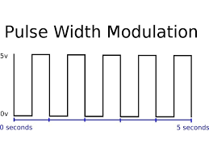
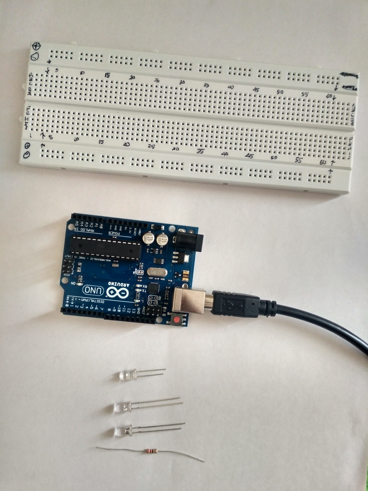

# TOC
### 1. [Concepts](#Analog-output-and-input)
  * [Analog output and input](#Analog-output-and-input)
  * [Pulse width modulation](#Pulse-Width-Modulation)
### 2. [Code](https://google.com)

-----------------------------------------

#  Necessary Concepts
## Analog output and input
Analog output and input produce a range of numbers that go up and down
in sequence. On an Arduino some of the digital pins have a “~” symbol
next to them. These pins are used for analog output and use PWM (pulse
width modulation)

## Pulse Width Modulation
PWM is used to simulate an analog output with digital pins. A digital signal can be on or off, and it sends a pulse for on. PWM simulates an analog system using the digital signal by changing the length of the pulse; it’s “on” time to simulate pulses between 5V and 0V.

The below figure shows the pulse width to simulate the different voltage

## A simple demo of blinking a LED
# Required components:
### 1. Bread Board
### 2. 220 Ohm Resistor
### 3. Arduino Uno

